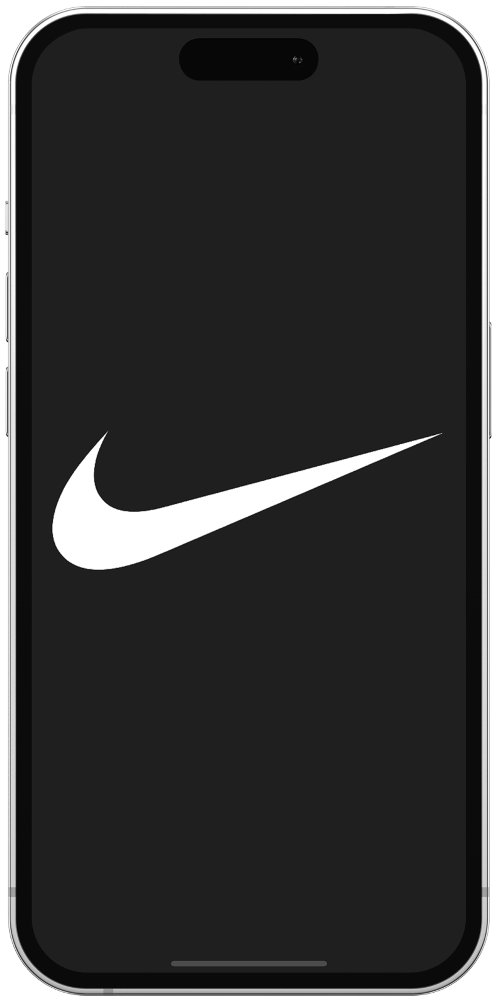
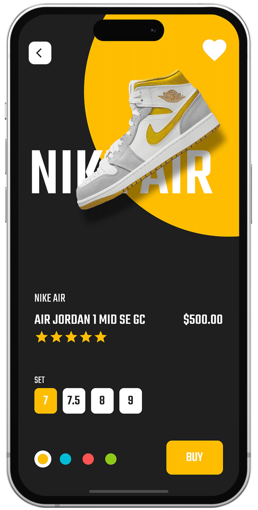

# sneaker_shop

A sneaker shop ui built with flutter.

Design inspiration: https://www.behance.net/gallery/163209725/NIKE-Shoe-app-UI

## Demo

## :iphone: Screens

Splash Screen | Home Screen | Details Screen | Details Screen |
:----------:|:-------------:|:--------------:|:--------------:|
 |  |  | 
 |  |  | 
